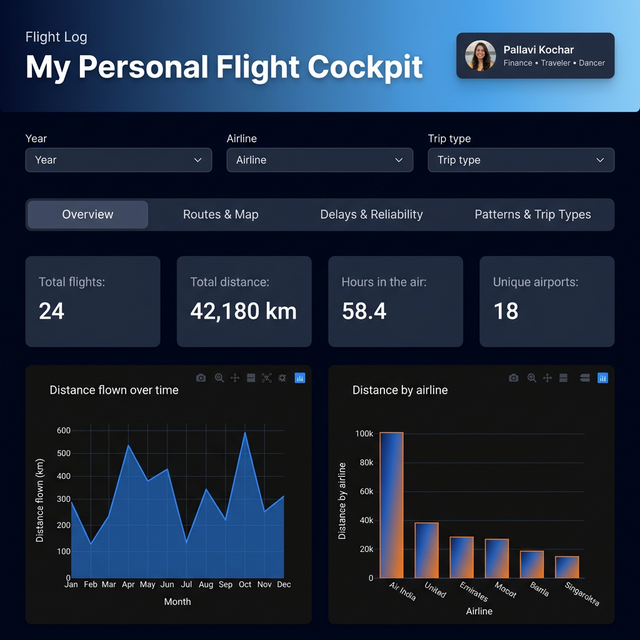

# ✈️ My Personal Flight Cockpit

A sleek, interactive personal flight dashboard built with **Python Dash** and **Plotly**. Track your flight history, visualize routes on a world map, analyze delays, and uncover travel patterns — all in a dark, premium UI.



---

## 🚀 Features

| Tab | What you get |
|-----|-------------|
| **Overview** | KPI stats (total flights, distance, hours, airports) + distance-over-time area chart + distance-by-airline bar chart |
| **Routes & Map** | Interactive world map with arc routes + top routes ranked bar chart |
| **Delays & Reliability** | On-time %, average & worst delay, delay-by-airline bars, delay heatmap (hour-of-day vs month) |
| **Patterns & Trip Types** | Trip type donut chart, departure-time polar chart, normalized airline radar chart |

**Global filters** — slice everything by Year, Airline, and Trip Type instantly.

---

## 🛠️ Setup

### 1. Clone the repo
```bash
git clone https://github.com/pallavikochar/flight-dashboard.git
cd flight-dashboard
```

### 2. Create a virtual environment
```bash
python -m venv .venv
source .venv/bin/activate   # Windows: .venv\Scripts\activate
```

### 3. Install dependencies
```bash
pip install dash plotly pandas numpy
```

### 4. Run the dashboard
```bash
python flight_dashboard.py
```

Then open **[http://localhost:8050](http://localhost:8050)** in your browser.

---

## 📂 Data Format

The dashboard reads two CSV files from the same directory:

### `flights.csv`
| Column | Type | Description |
|--------|------|-------------|
| `date` | `YYYY-MM-DD` | Flight date |
| `airline` | string | Airline name |
| `from_airport` | string | Departure airport code |
| `to_airport` | string | Arrival airport code |
| `distance_km` | float | Flight distance in km |
| `duration_hr` | float | Flight duration in hours |
| `delay_min` | int | Delay in minutes (0 if on time) |
| `trip_type` | string | e.g. `Personal`, `Work`, `Vacation` |
| `dep_time_local` | `HH:MM` | Local departure time |
| `aircraft` | string | Aircraft type (optional) |

### `airports.csv`
| Column | Type | Description |
|--------|------|-------------|
| `airport` | string | Airport code (must match `flights.csv`) |
| `lat` | float | Latitude |
| `lon` | float | Longitude |
| `city` | string | City name |
| `country` | string | Country name |

> **Tip:** Add your own flights to `flights.csv` and the dashboard will update automatically on the next run.

---

## 🧰 Tech Stack

- **[Dash](https://dash.plotly.com/)** — Python web framework for reactive dashboards
- **[Plotly](https://plotly.com/python/)** — Interactive charts (area, bar, geo map, polar, radar, heatmap)
- **[Pandas](https://pandas.pydata.org/)** — Data wrangling
- **[NumPy](https://numpy.org/)** — Numerical utilities
- **[Space Grotesk](https://fonts.google.com/specimen/Space+Grotesk)** — Typography (via Google Fonts)

---

## 👤 Author

**Pallavi Kochar** · Finance · Traveler · Dancer

---

*Built with ❤️ and a lot of boarding passes.*
